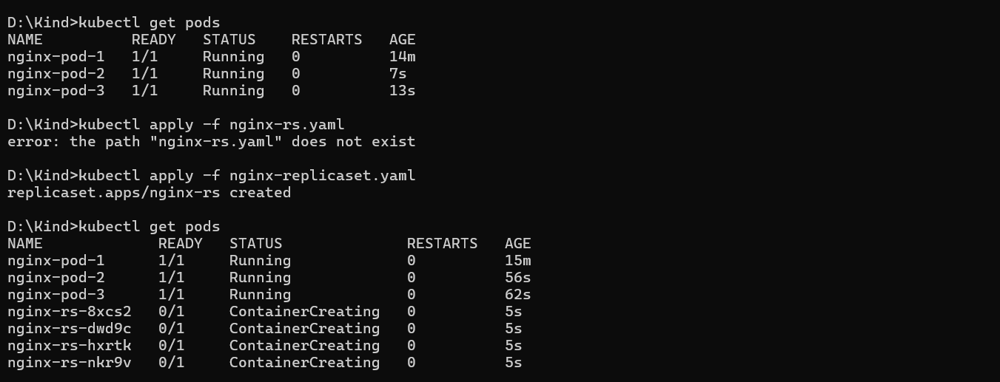
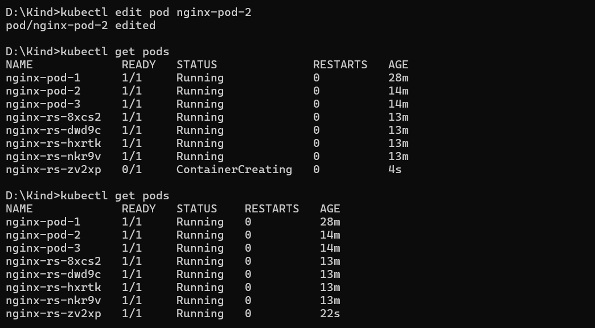

# Day 04 - ReplicaSets

## What I Did Today

Today I covered ReplicaSets: what they are, how the selector works under the hood, and two hands-on experiments that revealed some non-obvious behavior around label matching and pod ownership.

---

## What is a ReplicaSet

A ReplicaSet is a Kubernetes controller responsible for maintaining a desired number of pod replicas running at all times. You declare how many replicas you want in the manifest, and the ReplicaSet continuously watches the cluster to make sure that count is met.

Key behaviors:

- If a pod crashes or gets deleted, the ReplicaSet starts a new one to restore the desired count.
- If the `replicas` field is not specified in the manifest, it defaults to 1.
- Every pod managed by a ReplicaSet has a `Controlled-By` field in its metadata that points back to the owning ReplicaSet.
- To avoid a single point of failure, the ReplicaSet schedules pods across different worker nodes rather than stacking them on one machine.

---


## ReplicaSet vs ReplicationController

ReplicaSet is the successor to ReplicationController. Both serve the same purpose and behave similarly, but ReplicationController only supports equality-based label selectors (`=`, `!=`). ReplicaSet also supports set-based selectors through `matchExpressions`, which gives you much more flexibility in how you target pods.

---


## The Selector and How It Claims Pods

The `selector` field is one of the most important parts of a ReplicaSet manifest. It tells the ReplicaSet which pods it should own and manage.

```yaml
selector:
  matchLabels:
    app: nginx-app
    tier: frontend
```

`matchLabels` performs an AND operation. A pod is only claimed if it carries every label listed in `matchLabels`. A partial match is not enough.

There is also a subtlety worth knowing: a ReplicaSet is not limited to pods created by its own template. It will acquire any existing pod that:

1. Matches all the labels in its selector, and
2. Has no `OwnerReference`, or whose `OwnerReference` is not a Controller.

This means if you have bare pods already running with matching labels, the ReplicaSet will pull them in and count them toward the desired replica count. This can produce unexpected behavior if you are not deliberate with your labels.

**The takeaway:** be careful with the labels you put on bare pods. If they match a ReplicaSet's selector, that ReplicaSet will own them.

For more flexible label targeting, use `matchExpressions`
---


## The Manifest I Used

```yaml
apiVersion: apps/v1
kind: ReplicaSet
metadata:
  name: nginx-rs
  labels:
    app: nginx-app
    tier: frontend
spec:
  replicas: 5
  selector:
    matchLabels:
      app: nginx-app
      tier: frontend
  template:
    metadata:
      labels:
        app: nginx-app
        tier: frontend
    spec:
      containers:
      - name: nginx-rs
        image: nginx:latest
        ports:
          - containerPort: 80
            protocol: TCP
```

---


## Experiments


### Experiment 1: Label Acquisition

I wanted to see the selector behavior in action, so I created three bare pods manually before applying the ReplicaSet.

**Pod 1** (`nginx-pod-2`):

```yaml
labels:
  app: nginx-app
  tier: frontend
```

**Pod 2** (`nginx-pod-1`):

```yaml
labels:
  app: nginx-app
  type: frontend-server
```

**Pod 3** (`nginx-pod-3`):

```yaml
labels:
  tier: frontend
  on: always
```

With all three pods running, I applied the ReplicaSet with `replicas: 5` and `matchLabels: app: nginx-app, tier: frontend`.

My expectation was 8 total pods: 3 already running + 5 new ones from the ReplicaSet. The actual result was 7.

Pod 1 was the one that got claimed. It carried both `app: nginx-app` and `tier: frontend`, had no owner, and so the ReplicaSet absorbed it. Since it now counted as one of the five desired replicas, the ReplicaSet only spun up 4 additional pods.

Pod 2 was not claimed because it was missing `tier: frontend`. Pod 3 was not claimed because it was missing `app: nginx-app`. Neither matched all the selector labels.

---


### Experiment 2: Removing a Pod from the ReplicaSet by Changing Its Labels

In this experiment I edited the labels on Pod 1 (the one that had been absorbed by the ReplicaSet) so they no longer matched the selector.

The moment the label change was saved, the `replicaset-controller` detected that the pod no longer satisfied the selector. That pod became an orphan: it was no longer part of the ReplicaSet and lost its `Controlled-By` reference. Because the ReplicaSet now saw only 4 pods instead of 5, it immediately launched a new one to restore the desired count. The total pod count went from 7 to 8.

Screenshots from this experiment:

Before editing labels on Pod-1:


After editing labels on Pod-1:


---

