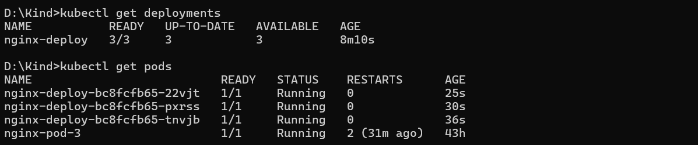
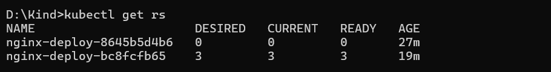
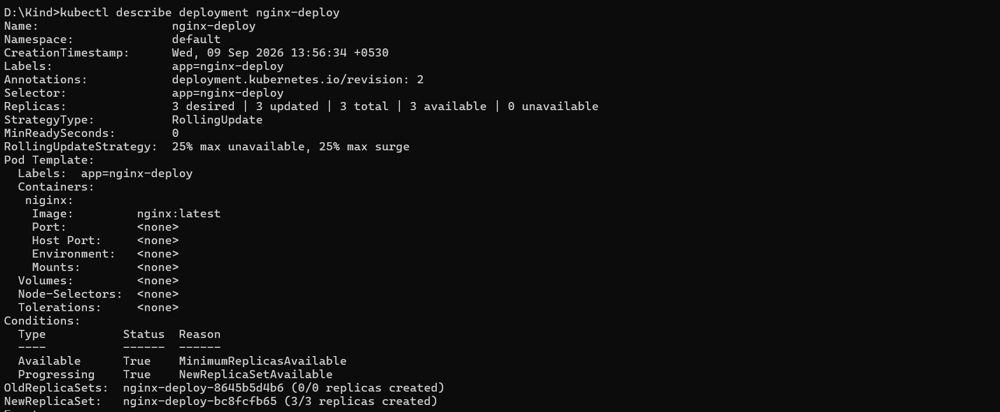
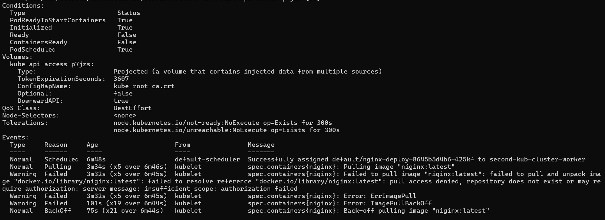

# Day 05 - Deployments

## What I Did Today

Today I covered Deployments: why they exist on top of ReplicaSets, how rolling updates work, and how to rollback when something goes wrong. I also ran into an `ImagePullBackOff` error during my experiments and traced it down to a misspelled image name.

---

## What is a Deployment

A Deployment does not manage Pods directly. Instead it acts as a manager that creates and controls a single active ReplicaSet, and that ReplicaSet is the one that actually maintains the running Pods.

```
[ Deployment ]
       |
       v
 [ ReplicaSet ]  <-- Maintains the replica count (e.g., 3 pods)
   .---.---.
   v   v   v
 [Pod][Pod][Pod]
```

---


## Why Does the Deployment Layer Exist

If a ReplicaSet can handle replicas on its own, why did Kubernetes add the Deployment layer on top?

The answer is rollouts and version history.

When you update your application (for example, changing the container image from `v1` to `v2`), the Deployment orchestrates the transition across two ReplicaSets:

1. It creates a brand-new ReplicaSet for `v2`.
2. It scales up the new `v2` ReplicaSet by one pod and scales down the old `v1` ReplicaSet by one pod. This is a Rolling Update.
3. It repeats this until the new ReplicaSet is fully up and the old one is at 0 pods.

```
      [ Deployment ]
       .----------.
       v          v
[ Old RS (v1) ] [ New RS (v2) ]
  (Scales down)   (Scales up)
```

Because the old ReplicaSet is kept at 0 replicas (not deleted), the Deployment can roll back to it instantly if something goes wrong.

---


## Creating a Deployment

**Imperative:**

```bash
kubectl create deployment my-nginx --image=nginx:latest --replicas=3
```

**Generating the manifest:**

```bash
kubectl create deployment my-nginx --image=nginx:latest --replicas=3 -o yaml > nginx-deploy.yml
```

**Declarative (production approach):**

```bash
kubectl apply -f nginx-deploy.yml
```

---


## The Manifest I Used

```yaml
apiVersion: apps/v1
kind: Deployment
metadata:
  labels:
    app: nginx-deploy
  name: nginx-deploy
spec:
  replicas: 3
  selector:
    matchLabels:
      app: nginx-deploy
  strategy:
    rollingUpdate:
      maxSurge: 25%
      maxUnavailable: 25%
    type: RollingUpdate
  template:
    metadata:
      labels:
        app: nginx-deploy
    spec:
      containers:
      - image: nginx:latest
        imagePullPolicy: Always
        name: nginx
        resources: {}
status: {}
```

The `strategy` block is what controls the rolling update behavior. `maxSurge: 25%` means Kubernetes can bring up 25% more pods than desired during the update. `maxUnavailable: 25%` means at most 25% of desired pods can be down at any point during the rollout.

---


## Useful Commands

**Get all deployments in the current namespace:**

```bash
kubectl get deployments
```



**Get the ReplicaSet created by the Deployment:**

```bash
kubectl get rs
```



**Get detailed information about a Deployment:**

```bash
kubectl describe deployment <deployment-name>
```



**Check the rollout status:**

```bash
kubectl rollout status deployment/<deployment-name>
```

---


## Troubleshooting: ImagePullBackOff

While running my experiment I noticed the pods were stuck in `ImagePullBackOff`. This error means the node tried to pull the container image and failed.

Common causes:

- The image name is misspelled
- The image tag does not exist
- Authentication issues with a private registry

In my case, I used `kubectl describe pod <pod-name>` to look at the events:

```bash
kubectl describe pod <pod-name>
```



The events section clearly showed the image name was `niginx` instead of `nginx`. A typo in the manifest caused all three pods to fail on startup.

**Fix:** Correct the image name in the YAML file and re-apply, or edit the live Deployment directly:

```bash
kubectl edit deployment <deployment-name>
```

As always, if you edit it live, make sure to reflect the fix in the YAML file before sharing it with anyone.

---


## Rolling Back a Deployment

If an update introduces a bug, you can undo it and return to the last stable state:

```bash
kubectl rollout undo deployment/<deployment-name>
```

To roll back to a specific revision:

```bash
kubectl rollout undo deployment/<deployment-name> --to-revision=<revision-number>
```

This is one of the main reasons to use Deployments over bare ReplicaSets. The old ReplicaSet is never fully deleted, so a rollback is just a matter of scaling it back up.

---

